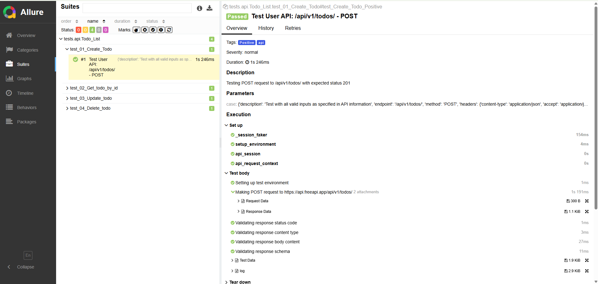
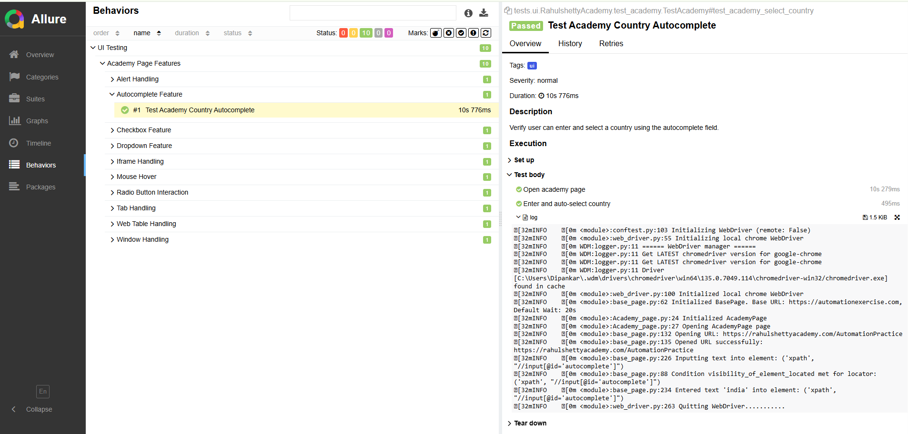

# Hybrid API and UI Automation Testing Framework

## Table of Contents
1. [Introduction](#introduction)
2. [Framework Architecture](#framework-architecture)
3. [Installation](#installation)
4. [Configuration](#configuration)
5. [Running Tests](#running-tests)
6. [API Testing](#api-testing)
7. [UI Testing](#ui-testing)
8. [Reporting](#reporting)
9. [Allure Reporting Implementation Guide](#Allure-Reporting-Implementation-Guide)
10. [Jenkins Integration](#jenkins-integration)
11. [Docker Integration](#docker-integration)
12. [Features Development: Post-Execution Notifications](#features-development-post-execution-notifications)
13. [Best Practices](#best-practices)


## Introduction

This hybrid automation testing framework is designed to support both API and UI testing using Python with pytest, requests, and Selenium. The framework follows a modular architecture with clear separation of concerns, making it easy to maintain and extend.

### Key Features

- Support for both API and UI testing
- Environment-based configuration (staging, production)
- Parameterized testing with data-driven approach
- Page Object Model pattern for UI testing
- Support for local and cloud-based browser testing (BrowserStack, LambdaTest)
- Comprehensive logging and reporting
- Modular and extensible architecture
- Data sharing between API tests

## Framework Architecture

The framework follows a layered architecture with the following components:

```
hybrid_python_automation_framework/
│
│
├── config/                      # Configuration files
│   ├── config.ini               # General framework configuration
│   ├── environment.py           # Environment configuration handler
│   ├── .env.staging             # Staging environment variables
│   └── .env.prod                # Production environment variables
│
├── test_data/                        # JSON test data files
│   └── TodoListData/            # Test data for API tests
│        ├── Create_todos.json   # Create To-Dos API test data
│        └── Delete_todo.json    # Delete To-Dos API test data
│
├── logs/                        # Test execution logs
│
├── reports/                     # Test reports
│   ├── html_report/             # HTML reports
│   └── screenshots/             # Test failure screenshots
│
├── src/                         # Source code
│   ├── base/                    # Base components
│   │   ├── api_client.py        # API client for making requests
│   │   └── web_driver.py        # WebDriver manager
│   │
│   ├── utils/                   # Utility modules
│   │   ├── api_utilities.py     # Utility and Validation functions for API testing
│   │   ├── file_reader.py       # File reader for test data
│   │   ├── logger.py            # Logging utility
│   │   ├── allure_reporter.py   # Allure Function
│   │   └── Shared_API_Data.py   # Shared data between API tests
│   │
│   └── pages/                   # Page Objects for UI testing
│       ├── base_page.py         # Base page with common methods
│       └── locators.py          # UI element locators
│       ├── RahulshettyAcademyPage/
│
├── tests/                       # Test modules
│   ├── api/                     # API tests
│   └── ui/                      # UI tests
│
├── conftest.py                  # Pytest fixtures and configuration
├── pytest.ini                   # Pytest configuration
├── requirements.txt             # Dependencies
└── README.md                    # Project documentation
```

## Installation

### Prerequisites

- Python 3.8 or higher
- pip (Python package installer)
- Chrome, Firefox, or Edge browser

### Setup

1. Clone the repository:
```bash
git clone <repository-url>
cd hybrid_python_automation_framework
```

2. Create and activate a virtual environment:
```bash
python -m venv venv
source venv/bin/activate  
# On Windows: venv\Scripts\activate
```

3. Install dependencies:
```bash
pip install -r requirements.txt
```

## Configuration

### Environment Configuration

The framework supports different environments (staging, production) through environment-specific configuration files:

- `.env.staging`: Staging environment variables
- `.env.prod`: Production environment variables

These files contain environment-specific variables such as API URLs, credentials, and browser settings.

### Environment Variables

The following environment variables are used by the framework:

#### API Testing
- `TO_DOS`: TO_DOS Base URL for API testing


#### UI Testing
- `UI_BASE_URL`: Base URL for UI testing
- `BROWSER`: Browser to use for UI tests (chrome, firefox, edge)
- `HEADLESS`: Whether to run browser in headless mode (True/False)
- `IMPLICIT_WAIT`: Implicit wait time in seconds
- `EXPLICIT_WAIT`: Explicit wait time in seconds

#### Remote Testing
- `REMOTE_URL`: URL for remote WebDriver (BrowserStack/LambdaTest)
- `BS_USERNAME`: BrowserStack/LambdaTest username
- `BS_ACCESS_KEY`: BrowserStack/LambdaTest access key
- `PLATFORM`: Platform for remote testing (Windows, macOS, iOS, Android)
- `BROWSER_VERSION`: Browser version for remote testing
- `RESOLUTION`: Screen resolution for remote testing

## Running Tests

### Command Line Options

The framework supports various command line options for test execution:

- `--environment`: Specify the environment (staging, prod)
- `--browser`: Specify the browser for UI tests (chrome, firefox, edge)
- `--remote`: Run tests on remote browser (BrowserStack/LambdaTest)
- `--platform`: Specify platform for remote testing (Windows, macOS, iOS, Android)
- `--headless`: Run browser in headless mode
- `--test-type`: Type of tests to run (api, ui, all)

### Running API Tests

To run API tests only:

```bash
pytest tests --test-type=api --environment=staging -v
```

### Running UI Tests

To run UI tests locally:

```bash
pytest tests --test-type=ui --environment=staging --browser=chrome -v
```

To run UI tests on BrowserStack or LambdaTest:

```bash
pytest tests --test-type=ui --environment=staging --browser=chrome --remote --platform=Windows -v
```

### Running All Tests In Local

To run all tests:

```bash
pytest tests --test-type=all --environment=staging -v
```

## API Testing

### API Client

The framework includes a flexible API client (`API_Utilities/api_client.py`) that supports:

- Different HTTP methods (GET, POST, PUT, DELETE, PATCH)
- Request customization
- Response validation
- JSON schema validation
- Detailed logging

### API Utilities

The framework includes various utility modules for API testing:

- `api_utilities.py`: Utility functions for API testing
- `api_validations.py`: Validation functions for API testing
- `file_reader.py`: File reader for test data
- `Shared_API_Data.py`: Shared data between API tests

### Test Data

API test data is defined in JSON files (`data/test_data/AITestPlatformData/*.json`) with the following structure:

```json
{
  "positive": [
    {
      "endpoint": "/api/endpoint",
      "method": "GET",
      "headers": {
        "Content-Type": "application/json",
        "Authorization": "Bearer {{jwtToken}}"
      },
      "params": {},
      "payload": null,
      "expected_status": 200,
      "expected_schema": {}
    }
  ],
  "negative": [
    {
      "endpoint": "/api/endpoint",
      "method": "GET",
      "headers": {
        "Content-Type": "application/json",
        "Authorization": "Bearer {{jwtToken}}"
      },
      "params": {},
      "payload": null,
      "expected_status": 404,
      "expected_schema": {}
    }
  ]
}
```

### Creating API Tests

API tests are created using pytest's parameterization feature:

```python
import pytest
import os
from src.utils.shared_API_Data import shared_data
from src.utils.api_utilities import validate_response_code, validate_schema, validate_response_content_type, \
    validate_in_response_body, get_value_from_response
from src.utils.file_reader import read_file
from src.utils import logger
log = logger.customLogger()

testcasedata = read_file("TodoListData", 'Create_todos.json')

@pytest.mark.Positive
@pytest.mark.parametrize("case", testcasedata["Positive"])
def test_Create_Todo_Positive(api_request_context, case):

    log.info(f"Running test case: {case['description']}")

    baseURL = os.getenv('TO_DOS')

    # Make API request
    response = api_request_context.make_request(
        base_url=baseURL,
        method=case["method"],
        api_endpoint=case["endpoint"],
        header=case["headers"],
        payload=case["payload"]
    )

    # Validate response
    validate_response_code(response, case["expected_status"])

    # Validate content type
    validate_response_content_type(response)

    validate_in_response_body(response, 'data.title', case["payload"]["title"], 'title not matches')
    validate_in_response_body(response, 'data.description', case["payload"]["description"], 'description not matches')

    shared_data.set_data("todos_id", get_value_from_response(response, 'data._id'))

    # Validate schema if provided
    if "expected_schema" in case and case["expected_schema"]:
        validate_schema(response=response, schema=case["expected_schema"])
```

## UI Testing

### WebDriver Manager

The framework includes a WebDriver manager (`src/base/web_driver.py`) that supports:

- Local browser testing (Chrome, Firefox, Edge)
- Remote browser testing (BrowserStack, LambdaTest)
- Browser configuration (headless mode, window size, etc.)

### Page Object Model

UI tests follow the Page Object Model pattern with:

- Base page (`src/pages/base_page.py`) with common methods
- Page-specific classes
- Centralized locators (`src/pages/locators.py`)

### Creating UI Tests

UI tests are created using the Page Object Model pattern:

```python
import pytest
from src.pages.login_page import LoginPage
from src.pages.dashboard_page import DashboardPage
from API_Utilities.logger_utility import customLogger

log = customLogger()

class TestLogin:
    def test_valid_login(self, driver, ui_test_data):
        # Initialize pages
        login_page = LoginPage(driver)
        dashboard_page = DashboardPage(driver)
        
        # Perform login
        login_page.open_login_page()
        login_page.login("username", "password")
        
        # Verify login success
        assert dashboard_page.is_dashboard_displayed()
```

## Reporting

### HTML Reports

The framework generates HTML reports using pytest-html with custom enhancements:

- Test execution summary
- Environment information
- Test details with descriptions
- Screenshots for UI test failures

HTML reports are saved to `reports/html_report/report.html`.

### Logging

The framework includes comprehensive logging with:

- Console logging
- File logging to `logs/test_execution_<timestamp>.log`
- Configurable log levels (INFO, DEBUG, etc.)
- Detailed log format with timestamps and source information


## Allure Reporting Implementation Guide

## Overview

This document provides instructions on how to use Allure reporting in the automation framework. Allure provides rich and detailed test reports with features like test steps, attachments, and categorization.


## Setup

Allure is already included in the framework dependencies. Make sure you have installed all requirements:

```bash
pip install -r requirements.txt
```

To generate Allure reports, you need to install the Allure command-line tool:

### For Linux:
```bash
sudo apt-add-repository ppa:qameta/allure
sudo apt-get update
sudo apt-get install allure
```

### For macOS:
```bash
brew install allure
```

### For Windows:
```bash
scoop install allure
```

## Running Tests with Allure

To run tests with Allure reporting enabled, use the following command:

```bash
pytest tests --test-type=api --environment=staging --alluredir=reports/allure-results
```

This will run the tests and generate Allure result files in the `reports/allure-results` directory.

## Generating Allure Reports

After running the tests, generate the Allure report with:

```bash
allure serve reports/allure-results
```

This will generate and open the report in your default web browser.

To generate a static report:

```bash
allure generate reports/allure-results -o reports/allure-report
```

Then you can open the report by opening `reports/allure-report/index.html` in a web browser.

## Viewing the Allure Report

The Allure report provides a rich, interactive interface with:

1. **Overview**: Test execution summary with pass/fail statistics
2. **Categories**: Tests grouped by failure categories
3. **Suites**: Tests organized by test suites
4. **Graphs**: Visual representation of test results
5. **Timeline**: Chronological view of test execution
6. **Behaviors**: Tests organized by epics, features, and stories
7. **Packages**: Tests organized by packages

## Adding Screenshots and Other Attachments

You can attach screenshots, logs, and other files to the Allure report:


## Allure Features Used in Framework

The framework uses the following Allure features:

1. **Epic, Feature, and Story**: Hierarchical organization of tests
2. **Test Title and Description**: Detailed test information
3. **Severity Levels**: Indicating test importance
4. **Steps**: Breaking down test execution into logical steps
5. **Attachments**: Including screenshots, request/response data, and test data
6. **Dynamic Test Metadata**: Setting test metadata at runtime

## API Test Example

The API test example (`test_01_Create_Todo.py`) demonstrates:

- Setting Epic, Feature, and Story
- Adding test title and description
- Setting severity level
- Breaking down test into steps
- Attaching request and response data
- Attaching test data

Example:

```python
import allure
import pytest
import os
from src.utils.shared_API_Data import shared_data
from src.utils.api_utilities import validate_response_code, validate_schema, validate_response_content_type, \
    validate_in_response_body, get_value_from_response
from src.utils.file_reader import read_file
from src.utils.allure_reporter import (
    allure_step,
    add_allure_step,
    attach_request_data,
    attach_response_data,
    attach_test_data
)
from src.utils import logger


log = logger.customLogger()

testcasedata = read_file("TodoListData", 'Create_todos.json')

@allure.epic("API Testing")
@allure.feature("Todo_List")
@pytest.mark.Positive
@pytest.mark.parametrize("case", testcasedata["Positive"])
def test_Create_Todo_Positive(api_request_context, case):
    # Allure test metadata
    allure.dynamic.story("Positive User API Tests")
    allure.dynamic.title(f"Test User API: {case['endpoint']} - {case['method']}")
    allure.dynamic.description(f"Testing {case['method']} request to {case['endpoint']} with expected status {case.get('expected_status', 200)}")
    allure.dynamic.severity(allure.severity_level.NORMAL)
    # Attach test data to report
    attach_test_data(case)
    # Setup test
    add_allure_step("Setting up test environment")

    log.info(f"Running test case: {case['description']}")

    baseURL = os.getenv('TO_DOS')

    with allure.step(f"Making {case['method']} request to {baseURL}{case['endpoint']}"):
        # Attach request data
        attach_request_data(
            method=case["method"],
            url=f"{baseURL}{case['endpoint']}",
            headers=case["headers"],
            payload=case["payload"]
        )

        # Make API request
        response = api_request_context.make_request(
            base_url=baseURL,
            method=case["method"],
            api_endpoint=case["endpoint"],
            header=case["headers"],
            payload=case["payload"]
        )

        # Attach response data
        attach_response_data(response)

    # Validate response
    with allure.step("Validating response status code"):
        status_valid=validate_response_code(response, case["expected_status"])
    
    # Validate content type
    with allure.step("Validating response content type"):
        validate_response_content_type(response)
        
    # Validate response body
    with allure.step("Validating response body content "):
        validate_in_response_body(response, 'data.title', case["payload"]["title"], 'title not matches')
        validate_in_response_body(response, 'data.description', case["payload"]["description"], 'description not matches')


    shared_data.set_data("todos_id", get_value_from_response(response, 'data._id'))

    # Validate schema if provided
    with allure.step("Validating response schema"):
        if "expected_schema" in case and case["expected_schema"]:
            validate_schema(response=response, schema=case["expected_schema"])
```
### 📊 Sample Allure Report For API




## UI Test Example

The UI test example (`test_academy.py`) demonstrates:

- Setting Epic, Feature, and Story
- Adding test title and description
- Setting severity level
- Breaking down test into steps
- Attaching screenshots at different test stages

Example:

```python
import time
import allure
import pytest
from src.pages.RahulshettyAcademyPage.Academy_page import AcademyPage
from src.utils import logger

log = logger.customLogger()

@allure.epic("UI Testing")
@allure.feature("Academy Page Features")
class TestAcademy:

    @pytest.mark.ui
    def test_academy_radio_button(self, driver):
        allure.dynamic.story("Radio Button Interaction")
        allure.dynamic.title("Test Academy Radio Button Selection")
        allure.dynamic.description("Verify user can select a specific radio button on the academy page.")
        academy_page = AcademyPage(driver)
        with allure.step("Open academy page"):
            academy_page.open_academyPage_page()
        with allure.step("Select radio button by name"):
            academy_page.clickRadioButtonBaseonName("Radio2")

    @pytest.mark.ui
    def test_academy_select_country(self, driver):
        allure.dynamic.story("Autocomplete Feature")
        allure.dynamic.title("Test Academy Country Autocomplete")
        allure.dynamic.description("Verify user can enter and select a country using the autocomplete field.")

        academy_page = AcademyPage(driver)
        with allure.step("Open academy page"):
            academy_page.open_academyPage_page()
        with allure.step("Enter and auto-select country"):
            academy_page.enterandAutoselectCountry("india")

    @pytest.mark.ui
    def test_academy_select_dropdown(self, driver):
        allure.dynamic.story("Dropdown Feature")
        allure.dynamic.title("Test Academy Dropdown Selection")
        allure.dynamic.description("Verify user can select an option from the dropdown menu.")

        academy_page = AcademyPage(driver)
        with allure.step("Open academy page"):
            academy_page.open_academyPage_page()
        with allure.step("Select dropdown option by value"):
            academy_page.selectDropdownByValue("option3")

    @pytest.mark.ui
    def test_academy_select_checkBox(self, driver):
        allure.dynamic.story("Checkbox Feature")
        allure.dynamic.title("Test Academy Checkbox Selection")
        allure.dynamic.description("Verify user can select the checkbox.")
        academy_page = AcademyPage(driver)
        with allure.step("Open academy page"):
            academy_page.open_academyPage_page()
        with allure.step("Select checkbox"):
            academy_page.selectCheckBox()
```
### 📊 Sample Allure Report For UI



## Best Practices

1. **Use Hierarchical Organization**: 
   - Epic: High-level feature area (e.g., "API Testing", "UI Testing")
   - Feature: Specific feature (e.g., "Todo_List", "Authentication")
   - Story: User story or test scenario (e.g., "Login Functionality")

2. **Add Descriptive Titles and Descriptions**:
   - Title should be clear and concise
   - Description should provide more details about the test purpose

3. **Set Appropriate Severity Levels**:
   - BLOCKER: Tests that block further testing
   - CRITICAL: Critical functionality tests
   - NORMAL: Regular functionality tests
   - MINOR: Minor functionality tests
   - TRIVIAL: Trivial tests

4. **Use Steps to Break Down Tests**:
   - Each logical step should be wrapped in `allure.step`
   - Steps should be descriptive and follow a logical sequence

5. **Add Relevant Attachments**:
   - Screenshots for UI tests
   - Request/response data for API tests
   - Test data for both API and UI tests

6. **Handle Failures Gracefully**:
   - Attach additional information on test failure
   - Take screenshots on UI test failures


## Jenkins Integration

This section provides an example `Jenkinsfile` (Declarative Pipeline) for automating the execution of the Python pytest automation framework. This pipeline includes parameterized options for selecting the environment, test type, and UI testing configurations (local or cloud).

```groovy
pipeline {
    agent any
    environment {
        PYTHON_VERSION = "3.10"
        python_location = 'C:\\Program Files\\Python313\\python.exe'
        VENV_DIR = "venv"
        BS_CREDENTIALS_ID = "browserstack-credentials"
        LT_CREDENTIALS_ID = "lambdatest-credentials"
    }
    parameters {
        string(name: 'GIT_REPO_URL', defaultValue: 'https://github.com/DipankarDandapat/hybrid_python_automation_framework.git', description: 'Git repository URL for the automation framework')
        string(name: 'GIT_BRANCH', defaultValue: 'main', description: 'Git branch to checkout')
        choice(name: 'ENVIRONMENT', choices: ["staging", "prod"], description: 'Select the target environment')
        choice(name: 'TEST_TYPE', choices: ["api", "ui", "all"], description: 'Select the type of tests to run')
        choice(name: 'TEST_CASE_TYPE', choices: ["Positive", "Negative", "Semantic","Smoke","Regression"], description: 'Select the test type of tests case to run')
        choice(name: 'UI_LOCATION', choices: ["none", "local", "cloud"], description: 'Run UI tests locally or on cloud (Select \'none\' for API tests only)')
        choice(name: 'LOCAL_BROWSER', choices: ["chrome", "firefox", "edge"], description: 'Select the browser for local UI execution')
        booleanParam(name: 'HEADLESS_MODE', defaultValue: false, description: 'Run the local browser in headless mode?')
        choice(name: 'CLOUD_PROVIDER', choices: ["browserstack", "lambdatest"], description: 'Select the cloud testing provider')
        string(name: 'CLOUD_PLATFORM', defaultValue: 'Windows 10', description: 'Specify the OS platform for cloud testing')
        string(name: 'CLOUD_BROWSER', defaultValue: 'chrome', description: 'Specify the browser name for cloud testing')
        string(name: 'CLOUD_BROWSER_VERSION', defaultValue: 'latest', description: 'Specify the browser version for cloud testing')
    }
    // triggers {
    //     parameterizedCron('''
    //         // H/5 * * * * %ENVIRONMENT=staging;TEST_TYPE=api;TEST_CASE_TYPE=Positive
    //         //H/5 * * * * %ENVIRONMENT=staging;TEST_TYPE=ui;UI_LOCATION=local;LOCAL_BROWSER=chrome
    //         H/5 * * * * %ENVIRONMENT=staging;TEST_TYPE=ui;UI_LOCATION=cloud;CLOUD_PROVIDER=browserstack;CLOUD_BROWSER=firefox
    //     ''')
    // }
    
    
    stages {
        
        stage('Cleanup Workspace') {
            steps {
                // Clean workspace before build
                cleanWs()
                echo "Cleaned up workspace."
            }
        }
        stage('Checkout Code from GIT') {
            steps {
                script {
                    echo "Checking out code from ${params.GIT_REPO_URL} branch ${params.GIT_BRANCH}"
                }
                checkout scmGit(
                    branches: [[name: "*/${params.GIT_BRANCH}"]],
                    extensions: [],
                    userRemoteConfigs: [[url: "${params.GIT_REPO_URL}"]]
                )
                echo 'Check out git successfully!'
            }
        }
        stage('Setup Python Environment') {
            steps {
                script {
                    echo "Setting up Python ${env.PYTHON_VERSION} virtual environment"
                    bat "\"${python_location}\" -m venv ${env.VENV_DIR}"
                    echo "Installing dependencies from requirements.txt"
                    bat "${env.VENV_DIR}\\Scripts\\activate && python -m pip install --upgrade pip && pip install -r requirements.txt"
                    echo "Installed dependencies ...."
                }
            }
        }
        stage('Execute Pytest Tests') {
            steps {
                script {
                    echo "Constructing pytest command based on parameters..."
                    
                    // Base pytest command with environment activation
                    def pytestCommand = "${env.VENV_DIR}\\Scripts\\activate.bat && pytest tests"
                    
                    // Add common options
                    //pytestCommand += " --verbose"
                    pytestCommand += " --environment=${params.ENVIRONMENT}"
                    
                    if (params.TEST_TYPE = 'api') {
                        pytestCommand += " --test-type=${params.TEST_TYPE}"
                        pytestCommand += " -m=${params.TEST_CASE_TYPE}"
                        echo "Running only ${params.TEST_TYPE} tests."
                        
                    } else {
                        echo "Running all tests (API and UI)."
                    }
                    // Add test type filtering marker if not running 'all'
                    if (params.TEST_TYPE != 'all') {
                        pytestCommand += " --test-type=${params.TEST_TYPE}"
                        // pytestCommand += " -m=${params.TEST_CASE_TYPE}"

                        
                        echo "Running only ${params.TEST_TYPE} tests."
                    } else {
                        echo "Running all tests (API and UI)."
                    }
                    
                    // --- Handle UI Test Parameters ---
                    def runUiTests = (params.TEST_TYPE == 'ui' || params.TEST_TYPE == 'all')
                    def uiLocation = params.UI_LOCATION
                    def executedInWithCredentials = false // Flag to track if sh command ran inside withCredentials
                    
                    if (runUiTests) {
                        if (uiLocation == 'local') {
                            echo "Configuring for uiLocation in local platform"
                            echo "Configuring for Local UI tests on ${params.LOCAL_BROWSER}"
                            pytestCommand += " --browser=${params.LOCAL_BROWSER}"
                            if (params.HEADLESS_MODE) {
                                pytestCommand += " --headless"
                                echo "Headless mode enabled."
                            }
                        } else if (uiLocation == 'cloud') {
                            echo "Configuring for Cloud UI tests on ${params.CLOUD_PROVIDER}"
                            pytestCommand += " --remote" // Flag to indicate cloud execution
                            pytestCommand += " --browser=${params.CLOUD_BROWSER}" // Cloud browser name
                            pytestCommand += " --platform=\"${params.CLOUD_PLATFORM}\"" // Cloud platform (ensure quoted)
                            // pytestCommand += " --browser-version=${params.CLOUD_BROWSER_VERSION}"
                            
                            // Remote URL based on provider
                            def remoteUrl = (params.CLOUD_PROVIDER == 'browserstack') 
                                ? "https://hub-cloud.browserstack.com/wd/hub"
                                : "https://hub.lambdatest.com/wd/hub"
                            // pytestCommand += " --remote-url=\"${remoteUrl}\""
                            
                            // Determine which credentials to use
                            def cloudCredsId = (params.CLOUD_PROVIDER == 'browserstack') 
                                ? env.BS_CREDENTIALS_ID : env.LT_CREDENTIALS_ID
                                
                            // Use withCredentials block to securely inject credentials
                            withCredentials([usernamePassword(
                                credentialsId: cloudCredsId, 
                                usernameVariable: 'CLOUD_USERNAME', 
                                passwordVariable: 'CLOUD_ACCESS_KEY')]) {
                                
                                // Add the credentials as command line arguments
                                // These will be processed by your conftest.py
                                pytestCommand += " --bs-username=\"${CLOUD_USERNAME}\"" 
                                pytestCommand += " --bs-access-key=\"${CLOUD_ACCESS_KEY}\""
                                
                                echo "Executing tests on ${params.CLOUD_PROVIDER} with secure credentials..."
                                
                                try {
                                    bat "${pytestCommand}"
                                    
                                    executedInWithCredentials = true // Mark as executed
                                } catch (err) {
                                    echo "Pytest execution failed: ${err.getMessage()}"
                                    currentBuild.result = 'FAILURE'
                                }
                            }
                        } else if (uiLocation == 'none') {
                            // If UI tests were selected but location is 'none', log a warning.
                            // The framework's conftest.py might skip UI tests if --browser is not provided, or you might add specific logic.
                            echo "UI Location set to 'none' but Test Type is '${params.TEST_TYPE}'. UI tests might be skipped or fail if not configured correctly."
                        }
                    } else {
                        echo "Skipping UI specific configuration as Test Type is 'api'."
                    }
                    
                    // --- Execute Pytest Command ---
                    // Execute the command only if it wasn't already run inside withCredentials (for cloud tests)
                    if (!executedInWithCredentials) {
                        echo "Executing Pytest command: ${pytestCommand}"
                        // Use try-catch to ensure pipeline continues to post actions even if tests fail
                        try {
                            bat  "${pytestCommand}"
                        } catch (err) {
                            echo "Pytest execution failed: ${err.getMessage()}"
                            // Optionally re-throw the error if you want the pipeline stage to fail
                            // throw err 
                            currentBuild.result = 'FAILURE' // Mark build as failed but continue to post actions
                        }
                    }
                    
                    
                }
            }
        }
    }
    
        post {
        always {
            script {
                echo "Pipeline finished. Archiving reports and logs..."
            }
    
            // Archive HTML report (still useful for download)
            archiveArtifacts artifacts: 'reports/html_report/report.html', allowEmptyArchive: true
    
            // Publish HTML report (renders it properly in Jenkins UI)
            publishHTML([
                reportDir: 'reports/html_report',
                reportFiles: 'report.html',
                reportName: 'Pytest HTML Report',
                reportTitles: 'Test Results Summary',
                keepAll: true,
                allowMissing: true,
                alwaysLinkToLastBuild: true
            ])
    
            // Archive log files
            archiveArtifacts artifacts: 'AutoLogs/*.log', allowEmptyArchive: true
    
            // Archive Allure results if needed (uncomment if configured)
            // allure([includeProperties: false, results: [[path: 'reports/allure-results']]])
        }
    
        success {
            script {
                echo "Pipeline completed successfully."
                // Add success notifications (e.g., Slack, Email)
            }
        }
    
        failure {
            script {
                echo "Pipeline failed."
                // Add failure notifications
            }
        }
    
        unstable {
            script {
                echo "Pipeline finished with unstable status (e.g., test failures)."
                // Add notifications for unstable builds if needed
            }
        }
    }

    
}
```


## Docker Integration

This section provides a sample `Dockerfile` to containerize the Python automation framework. This allows for consistent test execution environments across different machines and in CI/CD pipelines.

### Sample Dockerfile

```dockerfile
# Use an official Python runtime as a parent image
FROM python:3.10-slim

# Set the working directory in the container
WORKDIR /usr/src/app

# Copy the requirements file into the container at /usr/src/app
COPY requirements.txt ./

# Install any needed packages specified in requirements.txt
# Ensure pip is upgraded and then install dependencies
RUN pip install --no-cache-dir --upgrade pip && \
    pip install --no-cache-dir -r requirements.txt

# Copy the entire project directory into the container
COPY . .

# (Optional) If you have specific browser drivers or other system dependencies,
# you might need to install them here. For example, for Chrome:
# RUN apt-get update && apt-get install -y wget gnupg2
# RUN wget -q -O - https://dl-ssl.google.com/linux/linux_signing_key.pub | apt-key add -
# RUN sh -c 'echo "deb [arch=amd64] http://dl.google.com/linux/chrome/deb/ stable main" >> /etc/apt/sources.list.d/google.list'
# RUN apt-get update && apt-get install -y google-chrome-stable

# Default command to run when the container starts (example: run all tests)
# This might need to be adjusted based on how you trigger tests within the container.
# For instance, you might have a shell script that sets up environment variables and then runs pytest.
CMD [ "pytest", "tests", "--environment=staging", "--test-type=all" ]
```

### Building the Docker Image

To build the Docker image, navigate to the root directory of your project (where the `Dockerfile` is located) and run:

```bash
docker build -t python-automation-framework .
```

### Running Tests using Docker

Once the image is built, you can run your tests inside a Docker container. You might need to pass environment variables or mount volumes depending on your framework's configuration (e.g., for reports or test data).

Example of running the container:

```bash
docker run --rm -e ENVIRONMENT=staging -e TEST_TYPE=api python-automation-framework
```

If your tests generate reports and you want to access them on your host machine, you can mount a volume:

```bash
docker run --rm -v $(pwd)/reports:/usr/src/app/reports python-automation-framework
```

**Note:** This Dockerfile is a basic example. You may need to customize it further based on your project's specific dependencies (e.g., specific browser versions, database drivers, or other system libraries) and how you intend to run your tests within the container (e.g., passing dynamic parameters, handling cloud service credentials securely).


## 14. Features Development: Post-Execution Notifications

This section outlines how to implement features for sending notifications, such as email and Slack messages, after test execution. This is typically handled in the `post` section of a Jenkins pipeline or can be integrated into your test framework's reporting hooks.

### Sending Email Notifications

You can use Python's built-in `smtplib` and `email` modules to send email notifications. This is useful for sending summary reports or alerts on test completion or failure.

**Prerequisites:**

*   Ensure your Python environment has access to an SMTP server.
*   You might need to install `secure-smtplib` if you are using SSL/TLS: `pip install secure-smtplib` (though `smtplib` itself supports SSL/TLS).

**Example Python Script (to be called from Jenkins or your framework):**

```python
import smtplib
from email.mime.text import MIMEText
from email.mime.multipart import MIMEMultipart

def send_email(subject, body, sender_email, receiver_email, smtp_server, smtp_port, smtp_user, smtp_password, use_tls=True):
    """Sends an email notification."""
    try:
        message = MIMEMultipart()
        message["From"] = sender_email
        message["To"] = receiver_email
        message["Subject"] = subject

        message.attach(MIMEText(body, "html")) # Assuming body is HTML, use "plain" for plain text

        with smtplib.SMTP(smtp_server, smtp_port) as server:
            if use_tls:
                server.starttls()  # Secure the connection
            server.login(smtp_user, smtp_password)
            server.sendmail(sender_email, receiver_email, message.as_string())
        print(f"Email sent successfully to {receiver_email}!")
    except Exception as e:
        print(f"Error sending email: {e}")

# Example Usage (parameters would typically come from Jenkins environment or config files):
if __name__ == "__main__":
    email_subject = "Test Execution Report - COMPLETED"
    # You would dynamically generate this body, perhaps linking to the Allure or HTML report
    email_body = """
    <html>
        <body>
            <p>The automated test suite has completed.</p>
            <p>Status: SUCCESS</p> 
            <p>View the detailed report <a href=\"http://your-jenkins-url/job/your-job/Allure_20Report/\">here</a>.</p>
        </body>
    </html>
    """
    
    SENDER_EMAIL = "your_automation_email@example.com"
    RECEIVER_EMAIL = "your_team_email@example.com"
    SMTP_SERVER = "smtp.example.com"
    SMTP_PORT = 587 # Or 465 for SSL
    SMTP_USER = "your_smtp_username_or_email"
    SMTP_PASSWORD = "your_smtp_password_or_app_password"

    send_email(email_subject, email_body, SENDER_EMAIL, RECEIVER_EMAIL, 
               SMTP_SERVER, SMTP_PORT, SMTP_USER, SMTP_PASSWORD)
```

**Integration with Jenkins:**

In your `Jenkinsfile`, you can call this Python script in the `post` block:

```groovy
// Inside post { success {} } or post { failure {} } or post { always {} }
script {
    // Assuming the script is named send_notification.py and is in your workspace
    // You might need to activate your virtual environment if the script has dependencies
    sh ". ${env.VENV_DIR}/bin/activate && python path/to/your/send_notification_script.py --type email --status ${currentBuild.result}"
}
```

### Sending Slack Notifications

For Slack notifications, you can use the `slack_sdk` Python library. This allows for rich, formatted messages to be sent to specific Slack channels.

**Prerequisites:**

1.  Install the `slack_sdk`: `pip install slack_sdk`
2.  Create a Slack App and obtain a Bot User OAuth Token (starts with `xoxb-`).
3.  Add the bot to the desired Slack channel(s).

**Example Python Script:**

```python
import os
from slack_sdk import WebClient
from slack_sdk.errors import SlackApiError

def send_slack_message(channel_id, message_text, slack_bot_token):
    """Sends a message to a Slack channel."""
    client = WebClient(token=slack_bot_token)
    try:
        response = client.chat_postMessage(
            channel=channel_id,
            text=message_text,
            # You can use blocks for richer formatting:
            # blocks=[
            #     {
            #         "type": "section",
            #         "text": {
            #             "type": "mrkdwn",
            #             "text": message_text
            #         }
            #     }
            # ]
        )
        print(f"Slack message sent successfully to channel {channel_id}: {response["ts"]}")
    except SlackApiError as e:
        print(f"Error sending Slack message: {e.response["error"]}")

# Example Usage:
if __name__ == "__main__":
    # These would typically be environment variables or Jenkins credentials
    SLACK_BOT_TOKEN = os.environ.get("SLACK_BOT_TOKEN") # Store securely!
    SLACK_CHANNEL_ID = "C0XXXXXXX" # Your target channel ID

    if not SLACK_BOT_TOKEN:
        print("Error: SLACK_BOT_TOKEN environment variable not set.")
    else:
        test_status = "SUCCESS"
        report_url = "http://your-jenkins-url/job/your-job/HTML_20Report/"
        slack_message = f"Test Execution Completed!\nStatus: *{test_status}*\nHTML Report: {report_url}"
        
        send_slack_message(SLACK_CHANNEL_ID, slack_message, SLACK_BOT_TOKEN)
```

**Integration with Jenkins:**

Similar to email, you can call this script from your `Jenkinsfile`. Ensure the `SLACK_BOT_TOKEN` is managed securely using Jenkins Credentials.

```groovy
// Inside post { ... } section
script {
    withCredentials([string(credentialsId: 'slack-bot-token-credential', variable: 'SLACK_TOKEN_FROM_JENKINS')]) {
        // Set it as an environment variable for the script
        env.SLACK_BOT_TOKEN = SLACK_TOKEN_FROM_JENKINS
        sh ". ${env.VENV_DIR}/bin/activate && python path/to/your/send_notification_script.py --type slack --status ${currentBuild.result}"
    }
}
```

**Considerations for Both:**

*   **Security:** Store credentials (SMTP passwords, Slack tokens) securely, for example, using Jenkins Credentials and injecting them as environment variables rather than hardcoding them in scripts.
*   **Modularity:** Create separate utility scripts or functions for notifications and call them from your main test execution logic or CI pipeline.
*   **Content:** Tailor the notification content to provide relevant information, such as test status, links to reports, and specific failure details if applicable.
*   **Error Handling:** Implement robust error handling in your notification scripts to prevent them from failing the entire pipeline if a notification service is temporarily unavailable.

## Best Practices

### API Testing

- Use parameterized tests for different test cases
- Validate response status codes and schemas
- Share response data between related tests
- Handle API errors gracefully
- Keep test data in JSON files

### UI Testing

- Follow the Page Object Model pattern
- Keep locators centralized and well-organized
- Use explicit waits for reliable element interactions
- Take screenshots on test failures
- Run tests in headless mode for CI/CD pipelines

### General

- Use descriptive test names and docstrings
- Keep test data separate from test logic
- Log important information for debugging
- Use fixtures for common setup and teardown
- Run tests in parallel when possible
